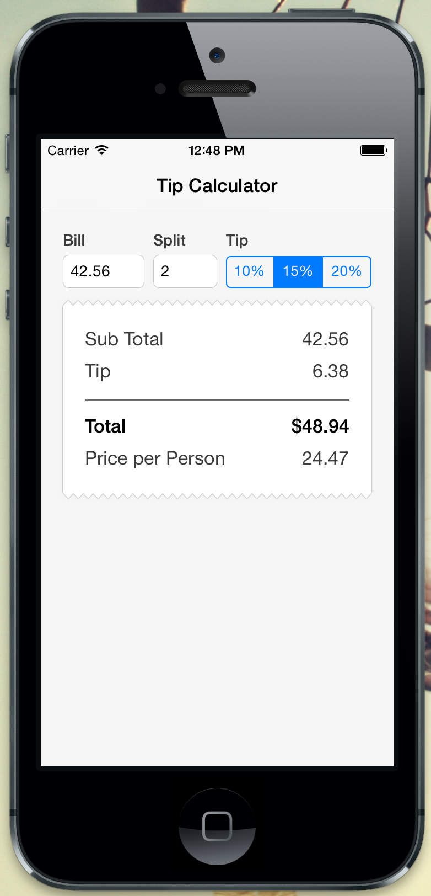

iphone-tipcalculator
====================

A tip calculator app for iPhone that supports bill splitting.

## Process

* Followed Tim Lee's tutorial: http://vimeo.com/74764846
* Rearranged the UI so user input is consolidated at the top and visible when the keyboard is up
* Added in bill splitting fuctionality
* Created a reciept-like view for calculation result

## Screenshot

